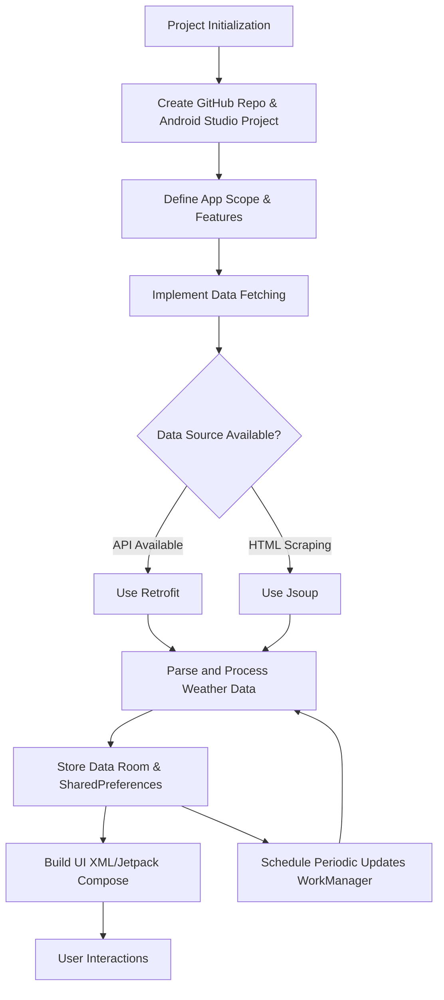

```mermaid
flowchart TD
    A[Project Initialization] --> B[Create GitHub Repo & Android Studio Project]
    B --> C[Define App Scope & Features]
    C --> D[Implement Data Fetching]
    D --> E{Data Source Available?}
    E -- API Available --> F[Use Retrofit]
    E -- HTML Scraping --> G[Use Jsoup]
    F & G --> H[Parse and Process Weather Data]
    H --> I[Store Data Room & SharedPreferences]
    I --> J[Build UI XML/Jetpack Compose]
    J --> K[User Interactions]
    I --> L[Schedule Periodic Updates WorkManager]
    L --> H
```

